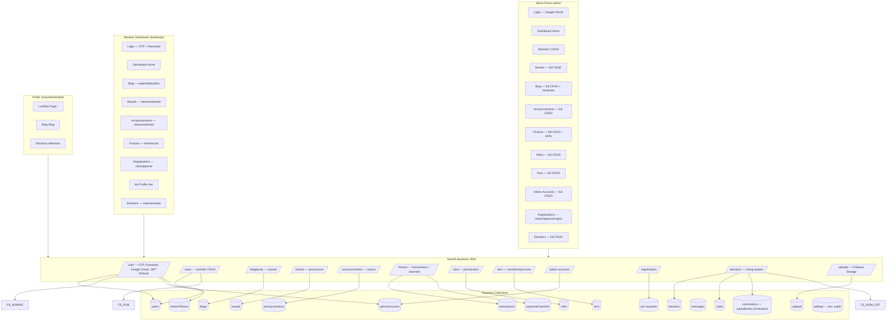
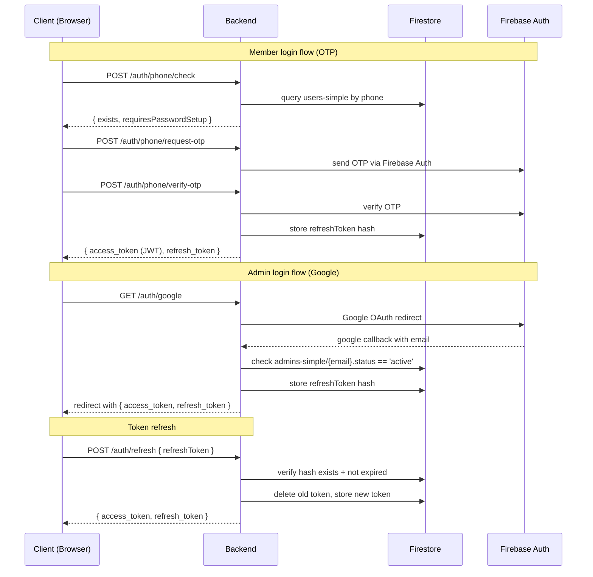
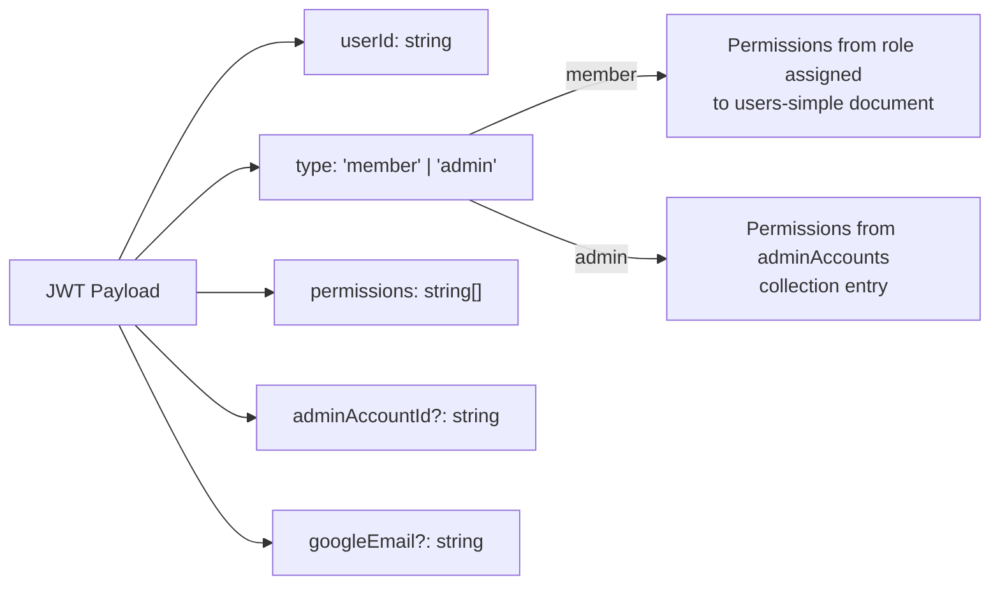

# System Overview

Full architecture of the Will Group platform — public site, member dashboard, and admin panel connected through the NestJS backend and Firestore.

## Token Architecture

## JWT Payload

