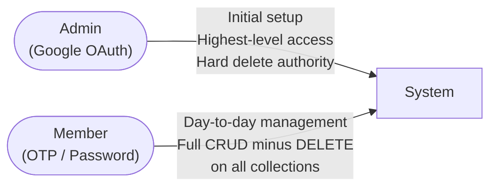
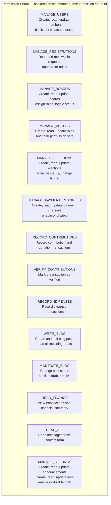
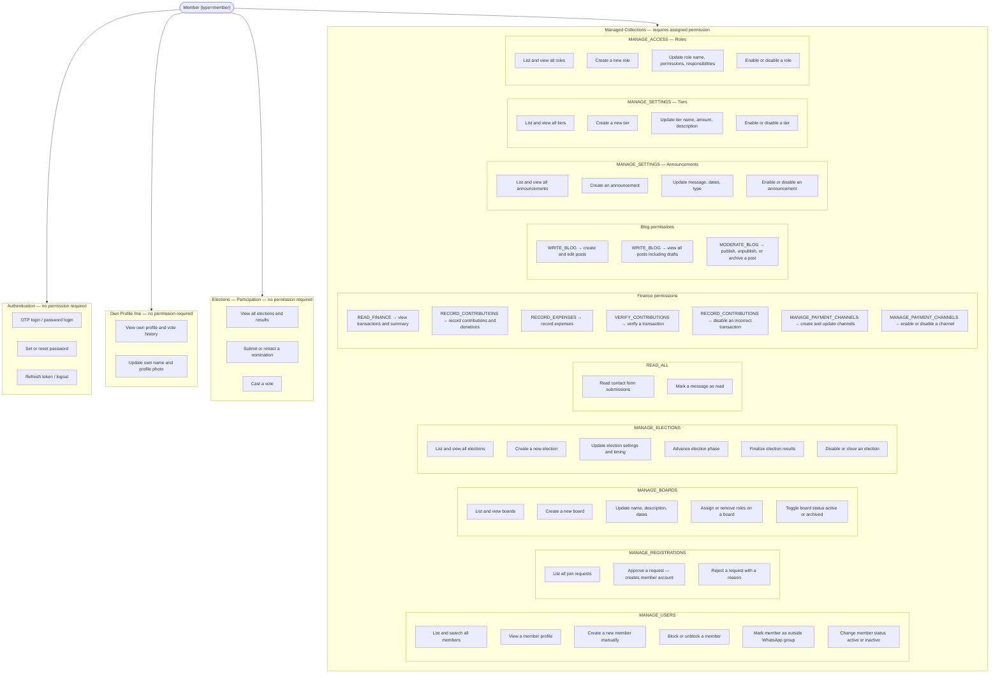
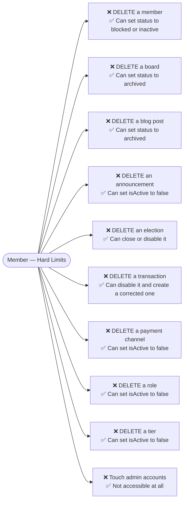
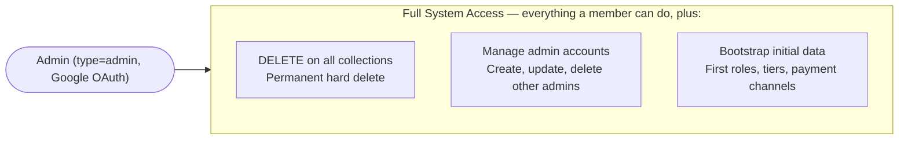
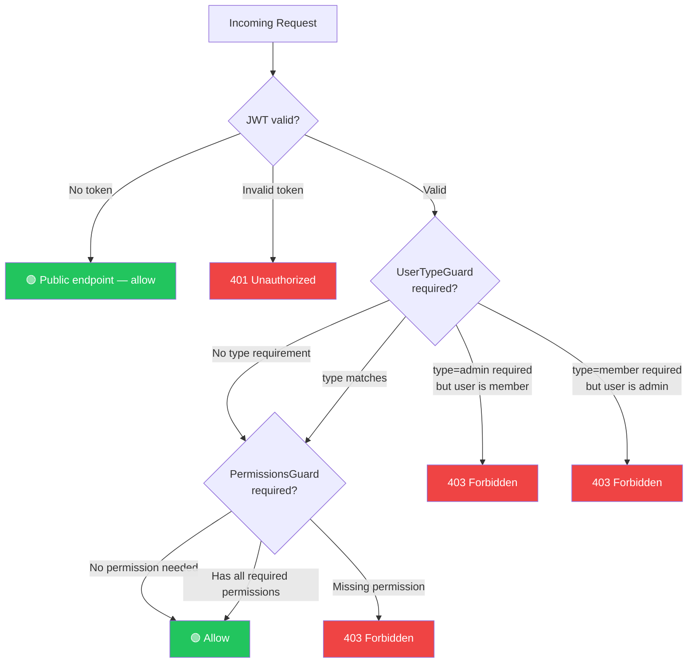
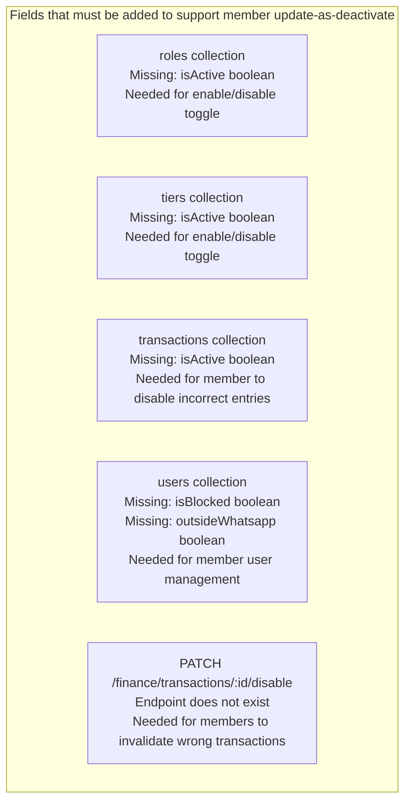

# RBAC — Roles, Permissions & Access Control

## Operating Philosophy

> **Rule**: Members run the platform. Admins bootstrap it and are the only ones who can permanently destroy data.
> Every collection supports Create + Read + Update for members. DELETE is admin-only, always.

---

## Permission Enum

---

## What a Member CAN Do

---

## What a Member CAN NEVER Do

---

## What an Admin CAN Do

> Admins hold all the same permissions as members. The difference is the `type=admin` JWT field, which is the only way to reach DELETE endpoints and admin-account management.

---

## Guard Chain

---

## Permission → Capability Map

| Permission | Member Can | Admin Also |
|---|---|---|
| MANAGE_USERS | GET, POST, PATCH /users — block, whatsapp flag, status | DELETE /users/:id |
| MANAGE_REGISTRATIONS | GET /registrations, PATCH status (approve/reject) | — |
| MANAGE_BOARDS | GET, POST, PATCH /boards — roles, status, description | DELETE /boards/:id |
| MANAGE_ACCESS | GET, POST, PATCH /roles — enable/disable | DELETE /roles/:id |
| MANAGE_ELECTIONS | GET all, POST, PATCH /elections — status, timing, advance, finalize | DELETE /elections/:id |
| MANAGE_PAYMENT_CHANNELS | GET, POST, PATCH /finance/payment-channels — enable/disable | DELETE /finance/payment-channels/:id |
| READ_FINANCE | GET /finance/transactions, GET /finance/summary | — |
| RECORD_CONTRIBUTIONS | POST /finance/transactions (type=contribution or donation), PATCH disable | — |
| RECORD_EXPENSES | POST /finance/transactions (type=expense) | — |
| VERIFY_CONTRIBUTIONS | PATCH /finance/transactions/:id/verify | — |
| WRITE_BLOG | GET all, POST, PATCH /blog/posts | — |
| MODERATE_BLOG | PATCH /blog/posts/:id/status | DELETE /blog/posts/:id |
| MANAGE_SETTINGS | GET, POST, PATCH /announcements and /tiers — enable/disable | DELETE both |
| READ_ALL | GET /messages, PATCH /messages/:id/read | — |
| *(admin-accounts)* | ❌ No access | GET, POST, PATCH, DELETE /admin-accounts |

---

## Missing Backend Fields (Design Gaps)

