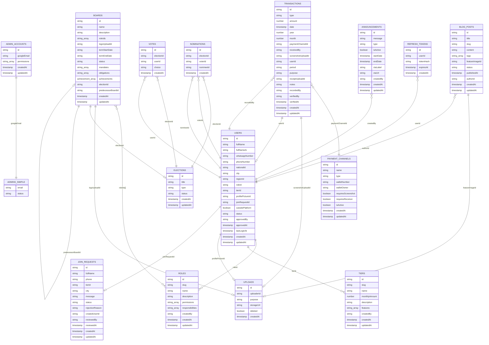
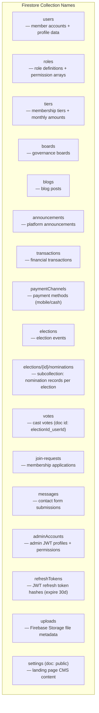
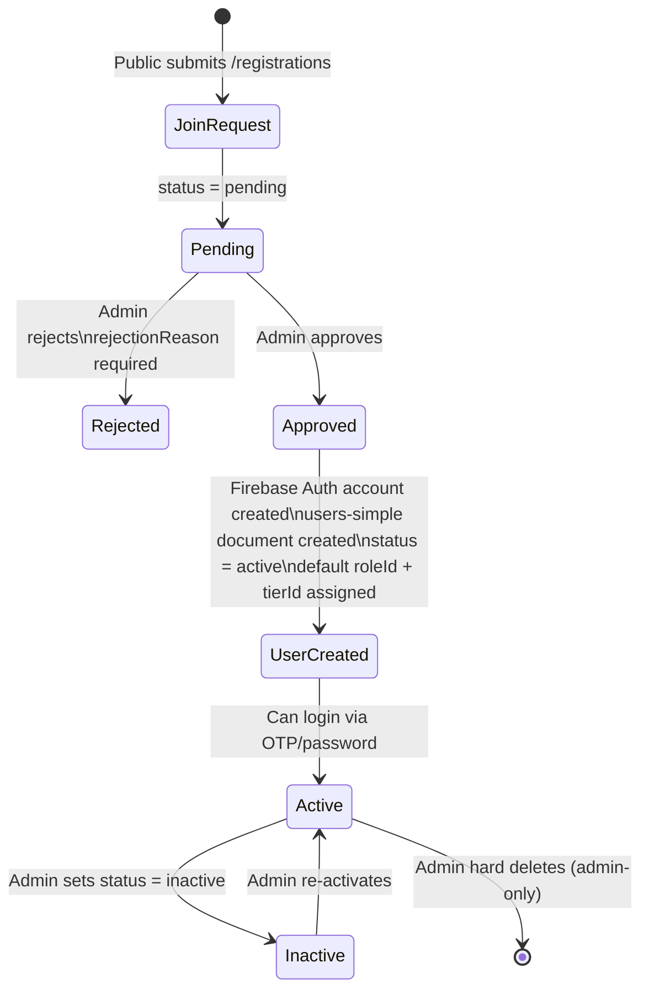
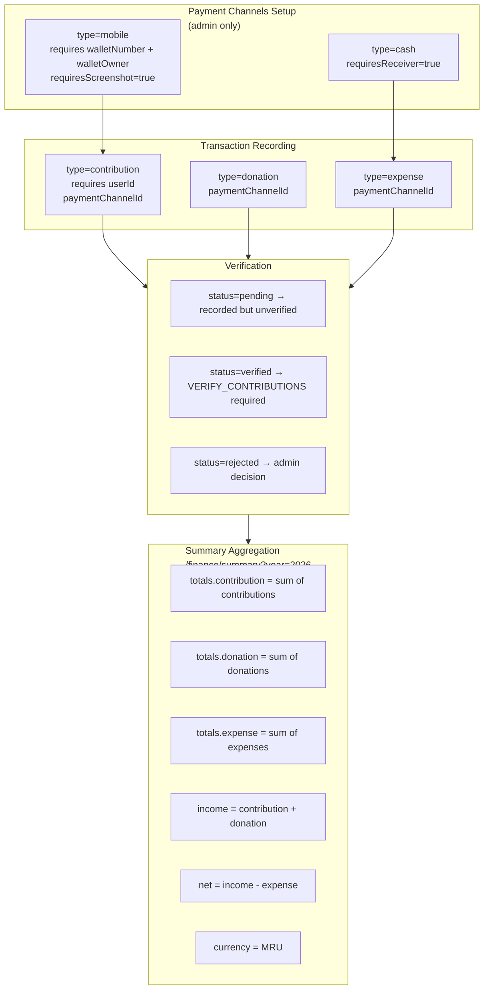
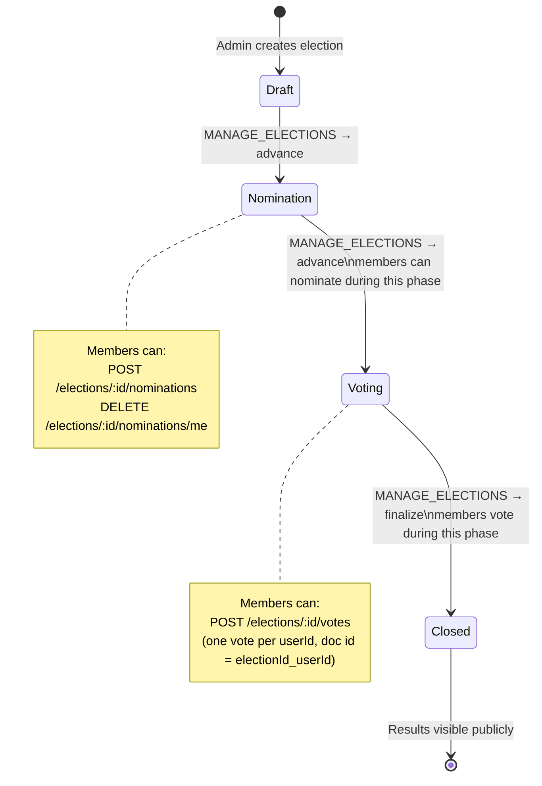

# Firestore Collections — Schema & Relationships

## Entity Relationship Overview

## Collection Names Reference (exact names used in backend)

> **Note:** `admins-simple`, `public-members`, `votes-simple`, `nominations-simple`, `nomination-counts`, `join-requests-simple`, `messages-simple`, `uploads-simple`, `blogs-simple`, `announcements-simple`, `elections-simple`, `roles-simple`, `tiers-simple`, `boards-simple` are **old collection names from a previous version** and are no longer used by the backend. They should be deleted from Firestore if they still exist.

## User Lifecycle

## Finance Data Flow

## Election Lifecycle

