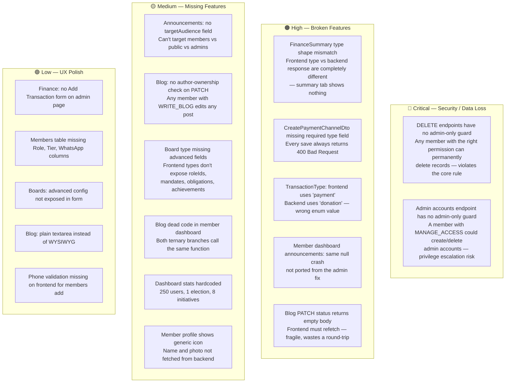
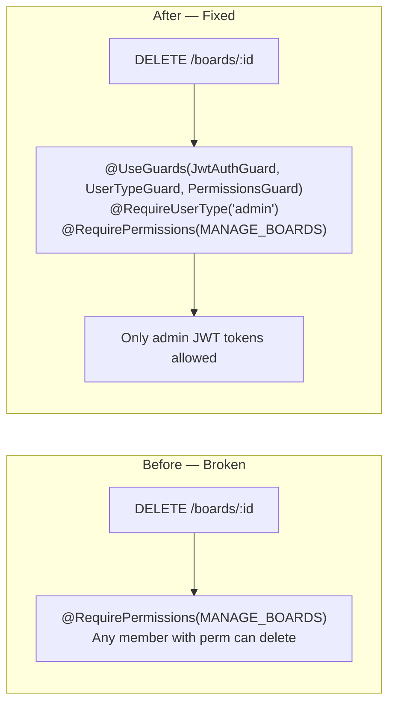
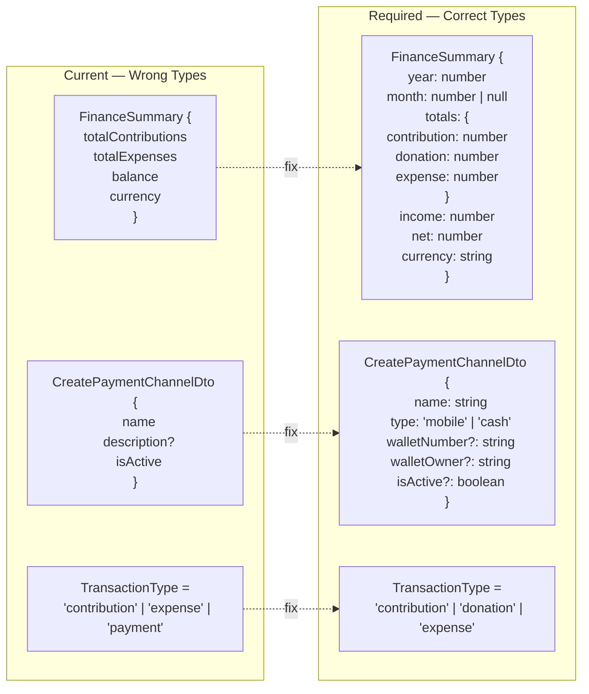
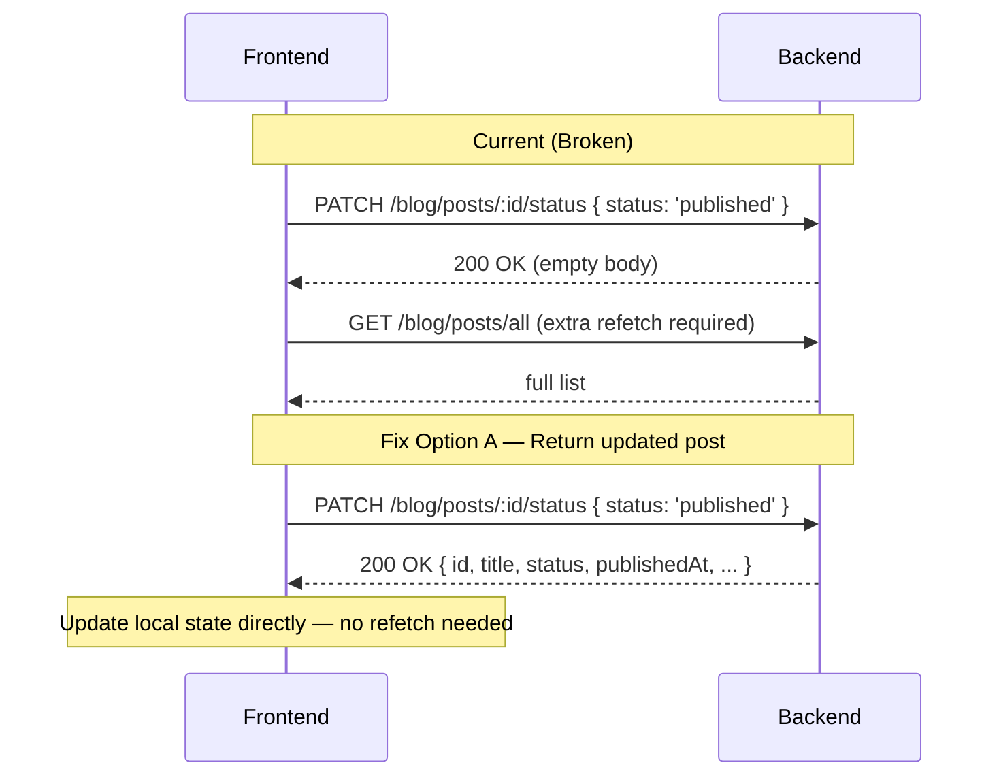
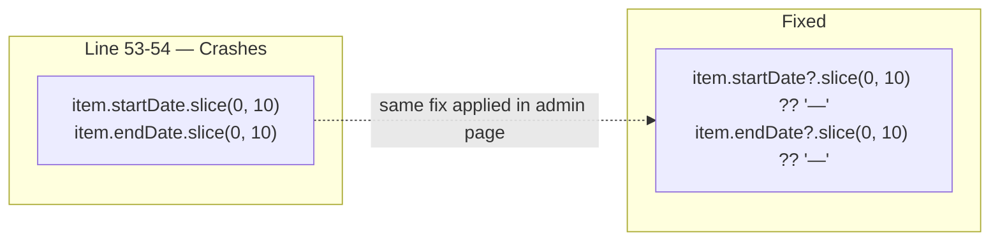
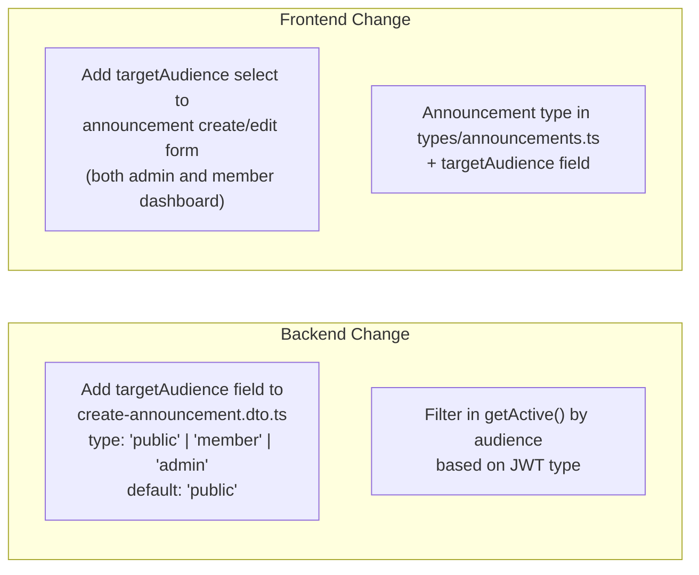
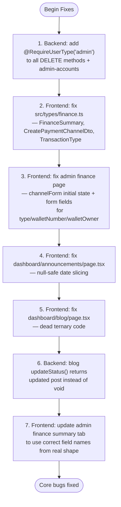

# Architectural Gaps & Required Fixes

## Priority Map

## Fix 1 — Admin-Only Guard on All DELETE Endpoints

**Files to change in backend:**
- `boards.controller.ts` — add `@RequireUserType('admin')` to `remove()`
- `blog.controller.ts` — add `@RequireUserType('admin')` to `remove()`
- `announcements.controller.ts` — add `@RequireUserType('admin')` to `remove()`
- `elections.controller.ts` — add `@RequireUserType('admin')` to `remove()`
- `users.controller.ts` — add `@RequireUserType('admin')` to `remove()`
- `roles.controller.ts` — add `@RequireUserType('admin')` to `remove()`
- `tiers.controller.ts` — add `@RequireUserType('admin')` to `remove()`
- `admin-accounts.controller.ts` — add `@RequireUserType('admin')` to all methods

## Fix 2 — Frontend Type Corrections

## Fix 3 — Blog Status Endpoint Response

**File to change:** `backend/src/modules/blog/blog.service.ts` — `updateStatus()` should return the updated document.

## Fix 4 — Null-Safe Dates in Member Announcements

**File:** `src/app/dashboard/announcements/page.tsx`

## Fix 5 — Add Announcement Target Audience

## Summary Fix Checklist

